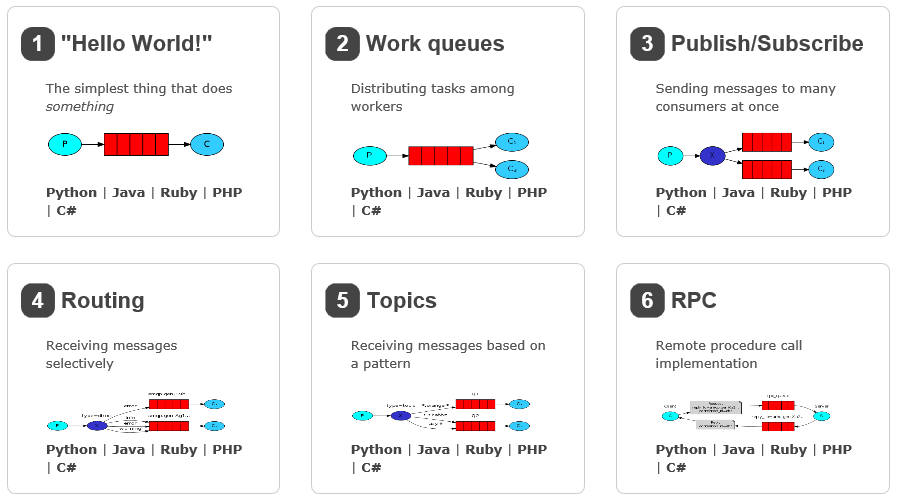

#RabbitMQ  

  

AMQP를 구현한 Opensource Message Brocker Software로 Publisher(Producer)로부터 메시지를 받아 Consumer에게 Route하는것이 주된 역활이다.  
이를 이용하면, Work Queues, Publish/Subscribe, Routing, Topics, RPC등의 모델을 구현할 수 있으며, 이 글에서는 작업 큐를 구현하는 방법을 다룬다.  

RabbitMQ는 다양한 프로토콜 기반의 Messaging Server를 구성할 수 있습니다.
AMQP(Advanced Message Queuing Protocol)
MQTT(Message Queuing Telemetry Transport)
STOMP(Streaming Text Oriented Message Protocol, Simple Text Oriented Message Protocol; STOMP)

RabbitMQ 이미지 설치만으로 관리 및 모니터링 환경을 갖출 수 있으며, UI뿐만 아니라 CLI(Command Line Interface)를 통해서도 서비스를 사용할 수 있습니다.

Messaging  
메시징은 소프트웨어 애플리케이션들을 연결시키고 확장 가능하게 해준다.  
애플리케이션들은 좀 더 큰 애플리케이션의 부품으로서 서로 연결되거나 혹은 사용자 디바이스와 데이터에 연결될 수 있다.  
메시징은 비동기적이고, 데이터를 주고 받는 것을 분리함으로써 애플리케이션들을 비동조화시킨다.  
데이터 전달, Non-Blocking 동작 혹은 Push Notification들을 생각할 수 있다.  
발행/구독, 비동기 프로세싱, 작업 큐 들을 사용하기 원할지도 모른다.  
이 모든 것은 패턴이며, 메시징의 한 부분을 구성한다.  

MQ(Message Queuing)  
Process 또는 Program Instance가 Data를 서로 교환할때 사용하는 방법  

MQ는 주로 어떤 요청이 서버로 왔을때 사용자 응답이랑 상관없는 긴 시간의 작업이 있는 경우,  
비동기처리로 작업을 진행하고 사용자에게 응답을 바로 해주고 싶을 경우 사용하게 된다.  
즉시 처리해야되는 부분이 아니라면 어딘가 메모리에 쌓아두었다가 꺼내어 처리할 때의 상황을 말한다.  
많은 양의 로그정보를 저장할 때 사용할 수도 있고, 다른 외부업체 시스템에 데이터를 전달해 주는 경우 등이 있을 수 있다.  

  

Sender => Queue => Receiver  
Sender : Publisher, Producer  
Queue : 실제구성은 Exchange(전달자) + Queue(Binding)으로 구성되어있다.  
Brocker로 표현됨.  
Receiver : Consumer 또는 Workder로 불린다.  
실제 작업을 하는 역활  

AMQP(Advanced Message Queueing Protocol)  
Opensource에 기반한 Standard Protocol이 AMQP  
AMQP 자체가 Protocol을 의미하기 때문에 이 Protocol을 구현한 MQ제품들은 여러가지가 있으며 그 중 하나가 RabbitMQ다.  

Meesage Brocker Software OpenSource  

AMQP의 구성요소와 라우팅 알고리즘
  
AMQP의 Routing Model은 Exchange, Queue 그리고 Binding으로 구성된다.  

Exchange는 Publisher(Producer)로부터 Received Message를 Queue에 분배하는 Router역활을 하며,  
Queue는 Message를 Memory나 Disk에 저장했다가 Consuer에게 Message를 전달하는 역활을 한다.  
Exchange Type은 Message를 어떠한 방법으로 Routing할지 결정하는 일종의 Algorithm을 말한다.

**AMQP Exchange Type**  
Direct Exchange : Exchange에 바인딩된 Queue중에 Message의 Routing Key와 맵핑되어 있는 Queue로 Message를 전달한다.  
1:1관계로 Unicast방식에 적합하며, 주로 Round Robin방식으로 여러 Workers(Consumer)간 Task를 분리에 사용된다.  

Fanout Exchange : Message의 Routing Key를 무시하고 Exchange에 Binding된 모든 Queue에 Message를 전달한다.  
1:N관계로 메시지를 Broadcast하는 용도로 사용된다.  

Topic Exchange : Exchange에 Binding된 Queue중에서 Message Routing Key가 Pattern에 맞는 Queue에게 모두 메시지를 전달한다.
Mulicast방식에 적합하다.  

Headers Exchange : 라우팅 키 대신 메시지 헤더에 여러속성들을 더해 속성들이 매칭되는 큐에 메시지를 전달한다.  

** RabbitMQ Exchange Type **  
Work Queues는 Direct Exchange가 적합하다.

Direct Exchange: (Empty string) and amq.direct
Fanout Exchange: amq.fanout
Topic Exchange: amq.topic
Headers Exchange: amq.match(and amq.headers in RabbitMQ)

Work Queues  
주문시스템에서 고객의 ==결제==가 이루어지면  
주문시스템으로부터 외부연동 서버로 파트너사와 ==연동하여 핀 발급==을 해달라는 요청을 받게 되고  
외부연동 서버는 이러한 요청이 들어올 때 대상 파트너 사에 전달할 ==주문정보들==을 ==메시지==로 만들어  
RabbitMQ에 넣고 요청을 마무리한다.  

Producer : 메시지를 생산  
Consumer : RabbitMQ에 담긴 메시지를 소비  

PRODUCER -publish-> Brocker(RabbitMQ) -Consume -> Consumer
Brocker(RabbitMQ) <-Subscribe- Consumer

Producer - RabbitMQ Server의 Queue에 적재  
Consumer - Queue에 있는 데이터를 pop후 작업  
작업중 모종의 이유로 오류가 발생할 경우 requeue  
메세지처리의 견고함을 보장하지만, 순서보장은 깨지게 된다.

RabbitMQ를 이용하는 주체, 크게 3가지로 분류
- Producer : 메시지를 보내는 주체
- Brocker : 메시지를 컨슈머에게 전달하는 주체
- Consumer : 메시지를 받아 소비하는 주체

## Brocker  
1. Clustering  
여러개의 노드를 하나의 클러스터로 운영
한개의 노드 운영시 노드가 동작을 하지 않는다면 상품정보를 업데이트 하지 못하게 된다.
하나의 노드가 작동하지 않더라도 다른 노드에 의해서 메시지를 전달할수 있다.

rabbitmqctl의 join_cluster 명령을 통해서 클러스터를 구성할 수 있다.
https://www.rabbitmq.com/clustering.html

**클러스터링시 주의할 점**  
모든 노드는 같은 ==Erlang 쿠키정보==를 가지고 있어야 한다.  
네트워크는 LAN을 통해서 구성되야 한다.  
모든 노드는 ==같은 버전==의 RabbitMQ와 Erlang으로 작동되어야 한다.  
클러스터에 참여하기전 노드는 DISK or RAM모드를 설정할 수가 있다.  
(RAM모드 설정시 메시지손실을 방지할 수 없기때문에 DISK모드를 권장한다.)  

** DISK or RAM 모드 **  
RAM, 메시지처리시간이 줄어들어 퍼포먼스를 높일 수 있지만 메시지의 영속성을 보장하지 못하게 되는 단점  
DISK, 메시지처리시간은 늘어나지만 메시지의 손실을 막을수 있게된다는 장점  

2. Exchange and Queue Durability  
브로커가 재시작이 되면 Exchanger 및 Queue는 이전의 정보를 가지고 동일하게 재구성되어야 한다.  
그렇지않다면 메시지를 보내지 못할뿐만 아니라 메시지를 받을수도 없는 상황이 발생하게 된다.  

브로커가 재시작이 되고 메시지를 보내게되면 해당 메시지를 처리하는 Exchanger가 존재하지 않아 메시지 손실이 발생한다.  
이러한 경우, Producer가 Confirm Mode일 경우 라우팅되지 못하였다는 메시지를 받을수 있다.  

Channel.exchangeDeclare(exchange_name, exchange_type, durable, auto_delete, args);
Channel.queueDeclare(queue_name, durable, exclusive, autoDelete, args);
exchangeDeclare, queueDeclare설정을 통해 Brocker 재기동시에도 이전의 정보를 가지고 복원되게 할수 있다.  
durable값을 true로 넘겨준다.  

3. Queue Mirroring  
같은 클러스터에 있는 모든 노드의 큐는 동일한 메시지를 가지지 않는다.  
하나의 노드가 동작하지 않는다면 큐에 있는 메시지는 노드가 다시 동작하지 않는 한 복구되지 않는다.  
큐 미러링을 통해서 이러한 점을 보완할수 있다.  

**큐 미러링 설정**  
rabbitmqctl set_policy 명령을 통해서 미러링 정책을 정할 수 있다.  
ex) rabbitmqctl set_policy -p {호스트명}{정책명}{큐이름(정규식 표현가능)){정책파라미터}  

rabbitmqctl set_policy -p host1 ha-all "^ha\." '{"ha-mode":"all"}'  
host1에 ha-all라는 정책이름을 가지고 'ha.'이름으로 시작하는 큐를 모든 노드에 미러링  

rabbitmqctl set_policy -p host1 ha-two "^two\." '{"ha-mode":"exactly", "ha-params":2}'  
host1에 ha-two라는 정책이름을 가지고 'two.'이름으로 시작하는 큐를 2개의 노드에만 미러링  

rabbitmqctl set_policy -p host1 ha-nodes "^nodes\." '{"ha-mode":"nodes", "ha-params":["rabbit@jun-VirtualBox"]};  
모든 노드의 큐에 미러링을 설정하게 된다면 메시지 신뢰성은 높아지겠지만 성능은 저하될 수 있다.  
따라서 미러링 큐의 갯수는 신뢰성, 속도 두 요소의 중요도에 따라서 적절히 조정해야한다.  

4. Master and Slave  
Queue에는 Master와 Slave 두가지 타입이 있다.  
모든 노드에 존재하는 각 Queue에는 반드시 하나의 Master Queue가 있어야 한다.  
Queue에 메시지가 Routing되면 가장 먼저 Master Queue에 들어오게 되고, 이후 Slave Queue에 전달된다.  
(FIFO)  

Queue에는 반드시 Master가 존재해야하기때문에, Master Queue를 가지고 있는 Node가 동작을 멈추게 된다면  
후보자들중에서 Master를 선택해야 한다.  
조건
msg sync: yes
type: disc
cluster join order
Master 선정 기본 정책은 가장 오래살아남고 Disk Mode로 동작하며 Msg Sync가 되어있는 Node가 선정된다.  
Cluster Join Order 및 Msg Sync에 따른 선정기준은 정책에 따라서 변할 수 있다.  
Msg unSync Node도 Master Node가 될수는 있지만 Msg손실이 발생한다.

** Message System을 운영하면서 우리가 중점적으로 다룬 내용은 Message의 손실을 최소화하는 방법이다. **  
1st, Cluster를 구성하여 가용할 수 있는 노드의 수를 늘리자.  
2nd, Server의 오류로 인해서 재가동시 이전의 설정으로 자동복원이 되도록 한다.  
3st, Queue Mirroring을 통해서 All Node에 Message Sync시킨다.  
4st, Queue의 Msater와 Slave에 대해서 고려하여 Server를 구성한다.  

다양한 플랫폼과 클라이언트 언어를 지원해야 한다.
메시지 신뢰성을 높여주는 기능을 지원해야 한다.
UI관리툴을 제공하여 쉽게 관리가 가능하도록 한다.

RabbitMQ 라우팅, 클러스터링, 오픈소스, 상업적지원 가능

상품정보 입력 툴
(상품정보 입력후, 메시지를 RabbitMQ에 보낸다)
->
RabbitMQ
(상품정보 메시지를 어플리케이션에 전달)
-> 
Application <-> DB
(메시지의 내용을 토대로 상품정보를 DB에 업데이트)
Application -> User
(DB에 저장된 상품정보를 사용자에게 보여준다)

\# rabbitmq_manager 설치
rabbitmq-plugins enable rabbitmq_management

\# rabbitmq-server 재시작
netstat -an | grep LIST
rabbitmq-server를 재시작하지 않아도, Port 15672가 Listening
Port 15671 Web Manager기능을 수행하는 Port

/etc/init.d/rabbitmq-server restart

설정파일 /etc/rabbitmq
어플리케이션 경로 /usr/bin
데이터 파일 경로 /var/lib/rabbitmq

rabbitmq구동시 "epmd" = Erlang Port Mapper Daemon는 클러스터 구동에 필요한 데몬
클러스터가 구동하지 않아도 데몬이 실행된다고 한다.

RabbitMQ는 Erlang언어로 작성되었으며 서비스 포트번호는 5672/tcp

reference url  
RabbitMQ로 메시지 손실 최소화 하는 법(1)  
http://tmondev.blog.me/221051503100  
[python] RabbitMQ 사용하기  
https://blog.naver.com/jooda99/221343892169  

